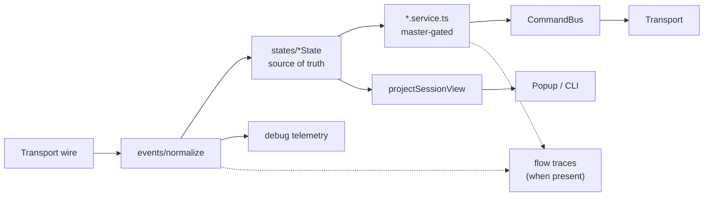

# Architecture

Stonegy Helper is an event-driven game automation stack. After the services/states migration, **domain `*State` classes own game data**; **feature `*Service` classes own automation**; the popup/CLI consume a projected `SessionView` / `BotState`.

## Pipeline



Inbound path (`GameSession.handleWireMessage`):

1. `recordDebugWireMessage` — wire + schema telemetry
2. `normalizeWireMessage` → `GameEvent[]`
3. `services.applyDomains(event)` — always runs (`PartyState`, `SessionState`, `HuntState`, …)
4. `CommandBus.notifyResponse` for matching outbound waits
5. `services.applyCores(event)` — only masters that are on
6. `projectSessionView` → `toBotState` → host `onChange`

Outbound game actions go through `session.commands` (`CommandBus`) only — never raw transport from services.

## Layering

Dependency direction: **protocol → domain → core → adapters**.

| Layer | Current paths | Role |
| --- | --- | --- |
| Protocol | `lib/binary/`, `lib/protocol.ts`, `lib/protocol-messages.ts` | Wire decode / message types |
| Domain (pure) | `lib/domain/` (e.g. `loot-sell.ts`), plus legacy `lib/inventory.ts`, `lib/market/*`, `lib/hunts.ts`, … | Session-free game logic; **no imports from `lib/core/`** (type-only `Settings` ok) |
| Core | `lib/core/` | Session, events, commands, services + states, projections, feature metadata |
| Adapters | `adapters/extension/`, `cli/` | Extension + CLI hosts; timers, storage, UI wiring |

**In progress:** pure modules migrate under `lib/domain/` — done for loot-sell, tasks, hunt guards, party invite-filter, tools auto-training; market re-exported via `lib/domain/market`.

### Core layout

```
lib/core/
  session.ts              # process owner: transport, settings, registry, CommandBus
  events/                 # normalize, schemas, debug-telemetry, flow-trace
  commands/               # CommandBus + registry/policy
  services/
    states/*.state.ts     # DomainState — game data (always dispatched)
    *.service.ts          # Feature services — automation (master-gated)
    register.ts           # DI wiring
    registry.ts           # applyDomains / applyCores / projectSessionView
  features/instances/     # UI labels, tab order, sub-feature metadata
  projections/            # SessionView types, patch, toBotState, project-events (tests)
  replay/                 # wire capture → GameSession replay harness
  transports/             # page-bridge, direct-ws
```

### Communication rules

- `states/` **never** import feature services.
- Services get other states/services via **constructor DI** (`register.ts`).
- Cross-service work: `ctx.emit(event)` (re-enters registry) or `session.commands`.
- Domain states always run; cores are skipped when their feature master is off.

## Where does X go?

| Change | Put it in |
| --- | --- |
| New game data field from wire | Domain `*State` (`lib/core/services/states/`) + projection slice |
| New automation behavior | `*Service` (`*.service.ts`), gated by feature master + settings |
| Pure selection / pricing / math | Domain module (`lib/market/pricing.ts`, etc.; target `lib/domain/`) — no `GameSession` |
| UI labels / tab / sub-feature metadata | `lib/core/features/instances/` |
| Outbound game action | `CommandBus` only (`session.commands.run` / `sendRaw`) |
| Wire decode / new opcode shape | `lib/binary/` or `lib/protocol*` + `events/normalize` (+ schema in `events/schemas/`) |

## Feature masters vs settings

- **Masters** (`FeatureMasters`: `market` \| `loot` \| `battle` \| `hunt` \| `tasks` \| `tools`) gate the **whole** core service. Registry skips `onEvent` / stops timers when off; turning off clears related settings via `getFeatureMasterOffPatch`.
- **Settings** (`lib/core/settings.ts`) gate **sub-behaviors** inside a service (e.g. `autoHuntEnabled`, `marketScanEnabled`, `autoSellLoot`). Sub-feature metadata in `features/instances/` maps settings → UI toggles.

Masters = power switch for a feature tab. Settings = knobs for behaviors under that tab.

## Debugging

- **Debug telemetry** (`events/debug-telemetry.ts`): every wire message is recorded; unknown types and payload schema mismatches are bucketed. Exposed on `BotState.debug` for the Debug panel / CLI.
- **Flow traces** (`events/flow-trace.ts` + `Service.traceFlow`): per-run records of guards, phases, and outcomes on loot / market / hunt / tasks / tools. Copy from Debug panel (“Copy last flow” / “Copy flow traces”).
- Prefer **exporting a capture** (debug events + wire payloads) over ad-hoc logging. Replay captures with `lib/core/replay/harness.ts` to turn bugs into regression fixtures.

Each feature service exposes a named flow phase via `snapshot()` (`lootFlow`, `marketFlow`, `huntFlow`, `toolsFlow`, tasker flow).

## Key types

- `GameEvent` — normalized inbound unit
- `DomainState` / `Service` — registry participants
- `SessionView` — projected snapshot (not the store of domain fields)
- `BotState` — settings + view + telemetry for hosts
